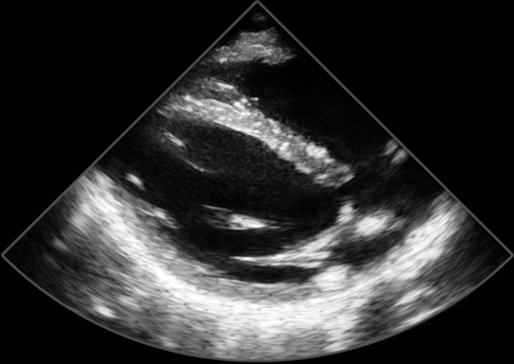
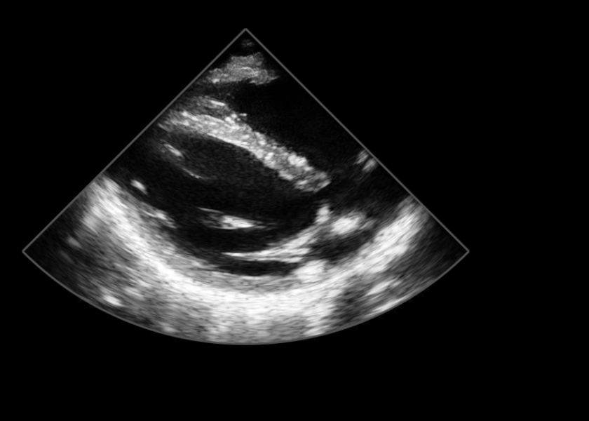

# HeartView by DESKi C SDK

Copyright (c) 2021-2023 DESKi SAS. All Rights Reserved.

## Overview

The HeartView SDK allows applications written in C99 or later or C++ to infer from a Cardiac UltraSound image an echocardiographic reference view and its quality.

## Table of contents

- [Releases](#releases)
- [Supported Platforms](#supported-platforms)
- [Credits](#credits)
- [HeartView SDK structure](#heartview-sdk-structure)
- [Prepare your project to integrate HeartView APIs](#prepare-your-project-to-integrate-heartview-apis)
  - [Compiler and linker configuration](#compiler-and-linker-configuration)
  - [Resources](#resources)
- [Use HeartView in your project](#use-heartview-in-your-project)
  - [Include header](#include-header)
  - [Setup HeartView engine](#setup-heartview-engine)
  - [Start and run HeartView engine](#start-and-run-heartview-engine)
  - [Expected input image format](#expected-input-image-format)
    - [Image encoding](#image-encoding)
    - [Image size](#image-size)
    - [UltraSound pixel region](#ultrasound-pixel-region)
    - [Create a compatible image with the library](#create-a-compatible-image-with-the-library)
  - [Cleanup HeartView engine](#cleanup-heartview-engine)

## Releases

- SDK can be obtained upon request

## Supported Platforms

- Windows: Tested on Windows 10

## Credits

DESKi HeartView is built upon opensource technologies.
The list of the corresponding license is available [here](license_credits.txt)

## HeartView SDK structure

```filetree
├── bin
│   ├── DirectML.dll
│   ├── heartview.dll
│   └── onnxruntime.dll
├── include
│   └── deski
│       └── hv
│           ├── heartview_api_exports.h
│           ├── heartview_api_types.h
│           ├── heartview_api_version.h
│           └── heartview_api.h
├── lib
│   └── heartview.lib
└── share
    ├── doc
    │   └── heartview
    │       ├── license_credits.txt
    │       └── README.md
    ├── trained
        ├── config_1_thread.json.enc
        └── model.onnx.enc
```

## Prepare your project to integrate HeartView APIs

These instructions assume that you're writing an application in C or C++ and want to use DESKi HeartView directly.

### Compiler and linker configuration

- Add SDK's `include` path to the project include paths
- Reference `lib/heartview.lib` into the project linker settings
- Deploy `heartview.dll`, `onnxruntime.dll` and `DirectML.dll` along the project executable or add SDK's `bin` directory to PATH environment variable

### Resources

The library binary doesn't embed any resources required to run inference.

A set of resources is provided:

1. [Inference runtime file](share/trained/model.onnx.enc)
1. [Inference configuration file](share/trained/config_1_thread.json.enc)

Your application is responsible to make these resources available to the DESKi HeartView API.

## Use HeartView in your project

All HeartView functions are synchronous functions and they are not thread safe.

### Include header

To access HeartView API:

```C
#include "deski/hv/heartview_api.h"
```

### Setup HeartView engine

Settings up the engine is done in 2 steps:

1. Create a configuration object
1. Create the engine instance

```c
    hv_configuration* configuration = nullptr;

    if (hv_create_configuration("share/trained/model.onnx.enc",
                                "share/trained/config_1_thread.json.enc",
                                kHvLogDebug,
                                &configuration) != kHvOk) {
        // Handle error;

    }

    hv* engine = nullptr;
    if (hv_create(configuration, &engine) != kHvOk) {
        // Handle error
    }
    // Configuration is not needed anymore
    hv_delete_configuration(configuration);
```

`hv_create_configuration` checks provided parameters such as file existence and configuration validity.

### Start and run HeartView engine

The code below shows a loop infering incoming UltraSound images.

```c
    if (hv_start(engine) != kHvOk) {
        // Hande error
    }

    while (ultrasound_stream_ok()) {
        void* raw_image_data = ultrasound_stream_get_next_image();

        // Build raw image format description
        hv_raw_image_info* info;
        uint32_t columns = 640;
        uint32_t rows = 452;
        uint32_t row_size_in_bytes = columns * 3;
        if (hv_create_raw_image_info(engine, rows, columns,
                                     kHvImageFormat_RGB_8UC3, row_size_in_bytes,
                                     &info) != kHvOk) {
            // Handle error
            break;
        }

        // Create HeartView image from ultrasound raw image
        hv_image* img = nullptr;
        if (hv_create_image(engine, info, raw_image_data, &img) != kHvOk) {
            // Handle error
            break;
        }
        hv_delete_raw_image_info(info);

        // Infer HeartView
        hv_heart_view predicted_view = kHvHeartViewInvalid;
        uint32_t predicted_quality = 0;
        if (hv_predict(engine, img, &predicted_view, &predicted_quality) != kHvOk) {
            // Handle error
            break;
        }

        // Notify other modules about the new prediction
        signal_new_prediction(predicted_view, predicted_quality);

        hv_delete_image(img);
    }

    hv_stop(engine);
```

`ultrasound_stream_ok`, `ultrasound_stream_get_next_image` and `signal_new_prediction` are pseudo functions to illustrate how the loop may be implemented.

HeartView engine infers from echo UltraSound image that should meet the [expected input image format](#expected-input-image-format). In order to convert image provided to HeartView engine with `hv_create_image`, one needs to describe the format of the provided raw image with `hv_create_raw_image_info` function. See [code snippet](#create-a-compatible-image-with-the-library)

In a user facing application, this code should not be executed on the UI/main thread as it may lead the UI to be unresponsive.

`raw_image_data` should remain valid from `hv_create_image` until `hv_delete_image` call.

One may choose invoke `hv_create_raw_image_info` for each raw image as the raw image size may change. However if the raw image size is constant, calling it once before the loop is advised

### Expected input image format

#### Image encoding

The library expects an RGB image where each channel is encoded on an unsigned 8 bits value.

#### Image size

The library can process an image of any size.

#### UltraSound pixel region

The UltraSound area center should be aligned with the input image center.

There should be no margin between UltraSound area and the input image borders.

Here is an example input image  (__the gray border is not expected at all__, it's just there for illustration):



Here is a wrong input image:



#### Create a compatible image with the library

Here is a code snippet that demonstrates how to create a compatible image with the library:

```C++
    hv_create_raw_image_info(engine, 512, 640,
                                     kHvImageFormat_RGB_8UC3, 640 * 3,
                                     &info)
    cv::Mat cvimg(512, 640, CV_8UC3);
    cv::randu(cvimg, cv::Scalar(0, 0, 0), cv::Scalar(255, 255, 255));
    // assume cvimg.isContinuous() returns true
    hv_create_image(engine, info, cvimg.data, &image);
```

### Cleanup HeartView engine

Final step is pretty simple:

```c
hv_delete(engine);
```
